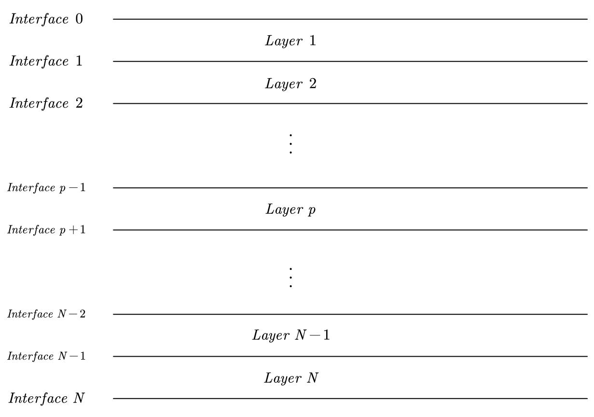

# 特征函数求解

## 浮力频率( Brunt-Vaisala 频率 )

表达式
$$
    N = \sqrt{ g \frac{\rho_0^\prime}{\rho_0} }
$$

其中 $g$ 为重力加速度, $\rho_0^\prime$ 为密度对深度的微分, $\rho$ 为密度。

从其表达式可以看出，当密度 $\rho$ 为常数时，浮力频率 $N$ 为 $0$。

对应于真实海水密度分布情况， $\rho_0^\prime$ 通常不为 $0$，因此 $N$ 通常不为 $0$。

因此，在前面的计算工作中，应保持 $N$ 不为 $0$, 但是对于海水密度变化不大的情况，可以将 $N$ 设置为一个较小的值，如 $0.0001$。

## 求解系数 $ Ap\quad and  \quad Bp$

在求出色散关系后，针对第 $m$ 个模态，有一组色散关系 $\omega(k)$ 的离散值，将每一组离散值带入到原微分方程中进行求解，原微分方程表达式如下
>注意：由于已经将盐水密度进行量化为 $N$ 层，因此针对第 $p$ 层，在微分方程中，将 $N_v$ 视为常数，而不是一个和深度 $z$ 有关的函数。实质上此时的微分方程为一个常系数微分方程。

$$
    \begin{equation}    
    \label{eq:1}
    \tag{1}
    \frac{d^2 \phi}{d z^2} +  k^2 \left( \dfrac{N^2}{\omega^2}-1 \right) \phi = 0 
    \end{equation}
$$
边界条件为
$$
    \begin{equation}
    \label{eq:2}
    \tag{2}
    \left\{
    \begin{array}{l}
        \phi(0) = 0 \\
        \phi(h) = 0
    \end{array}
    \right.
    \end{equation}
$$
其中 $N$ 为垂直方向的浮力频率，其表达式为$ N = \sqrt{ g \dfrac{\rho_0^\prime}{\rho_0} } $，$ k $为波数，$\omega$ 为频率，$\phi$ 为振幅。

对式 \eqref{eq:1} 进行变形，得到式 \eqref{eq:3}

$$
    \begin{equation}
    \label{eq:3}
    \tag{3}
    \frac{d^2 \phi}{d z^2} + k_3^2 \phi = 0
    \end{equation}
$$
其中，$k_3 = k^2 \left( \dfrac{N_v^2}{\omega^2} - 1 \right)$

针对第 $p$ 层的微分方程，此时化为式 \eqref{eq:4}
$$  
    \begin{equation}
    \label{eq:4}
    \tag{4}
    \frac{d^2 \phi}{d z^2} + k_{3p}^2 \phi = 0
    \end{equation}
$$
其中，$k_{3p}^2 = k_p^2 \left( \dfrac{N_p^2}{\omega^2} - 1 \right)$

对式 \eqref{eq:4} 进行求解，得到式 \eqref{eq:5}
$$
    \begin{equation}
    \label{eq:5}
    \tag{5}
    \phi = A_p \exp(m_{p} z) + B_p \exp(-m_{p} z)
    \end{equation}
$$
式中，$m_{p} = ik_{3p}$,显然有
$$
    \begin{equation}
    \label{eq:6}
    \tag{6}
    m_{p} =
    \begin{cases}
        实数  & \text{if } \omega > N_p \\
        虚数 & \text{if } \omega < N_p \\ 
    \end{cases}
    \end{equation}
$$
对式 \eqref{eq:5} 进行求导，得到式 \eqref{eq:7}
$$
    \begin{equation}
    \label{eq:7}
    \tag{7}
    \frac{d \phi}{d z} = m_{p} A_p \exp(m_{p} z) - m_{p} B_p \exp(-m_{p} z)
    \end{equation}
$$

    

        
    

针对一个N层的海水密度分布，其密度分布如图 $ (1) $ 所示.

用 $Layer \quad p$表示第 $p$ 层，用 $Interface \quad p-1 $和 $Interface \quad p$ 表示第 $p$ 层的上下界面。

现在开始对于 $A_p$ 和 $B_p$ 的递推求解

首先针对第一层，此时层高为 $h_1$，对于第一层，其上界面为 $Interface \quad 0$，下界面为 $Interface \quad 1$，此时将 $z = 0$ 代入式 \eqref{eq:5}和\eqref{eq:7} 中，得到式 \eqref{eq:8}

$$
    \begin{equation}
    \label{eq:8}
    \tag{8}
    \left\{
    \begin{array}{l}
        \phi_{0}(0) = A_1+B_1 \\
        \dot{\phi}_{0}(0) = m_1 A_1 - m_1 B_1
    \end{array}
    \right.
    \end{equation}
$$
根据边界条件 \eqref{eq:2}，有
$$
    \begin{equation}
    \label{eq:9}
    \tag{9}
    \left\{
    \begin{array}{l}
        \phi_{0}(0) = A_1+B_1 = 0\\
        \phi_{0}(0) = = m_1 A_1 - m_1 B_1
    \end{array}
    \right.
    \end{equation}
$$
所以有
$$
    \begin{equation}
    \label{eq:10}
    \tag{10}
    A_1 + B_1 = 0
    \end{equation}
$$

在针对第 $N$层，此时层高为 $h_N$，对于第 $N$ 层，其上界面为 $Interface \quad N-1$，下界面为 $Interface \quad N$，$z = h_N$ 代入式 \eqref{eq:5}和\eqref{eq:7} 中，得到式 \eqref{eq:11}
$$
    \begin{equation}
    \label{eq:11}
    \tag{11}
    \left\{
    \begin{array}{l}
        \phi_{N}(h_N) = A_N \exp(m_N h_N) + B_N \exp(-m_N h_N) \\
        \dot{\phi}_{N}(h_N) = m_N A_N \exp(m_N h_N) - m_N B_N \exp(-m_N h_N)
    \end{array}
    \right.
    \end{equation}
$$
结合边界条件，有
$$
    \begin{equation}
    \label{eq:12}
    \tag{12}
    \left\{
    \begin{array}{l}
        \phi_{N}(h_N) = A_N \exp(m_N h_N) + B_N \exp(-m_N h_N) = 0 \\
        \dot{\phi}_{N}(h_N) = m_N A_N \exp(m_N h_N) - m_N B_N \exp(-m_N h_N)
    \end{array}
    \right.
    \end{equation}
$$
令 $\eta_N = \exp(m_Nh_N)$, $\eta_N$ 为常数，所以有
$$
    \begin{equation}
    \label{eq:13}
    \tag{13}
    \eta_N^2A_N + B_N = 0
    \end{equation}
$$

现在建立第 $p$ 层和第 $p+1$ 层之间的关系，此时第 $p$ 层的上界面为 $Interface \quad p-1$，下界面为 $Interface \quad p$，第 $p+1$ 层的上界面为 $Interface \quad p$，下界面为 $Interface \quad p+1$，将 $z = h_p$ 代入式 \eqref{eq:5}和\eqref{eq:7} 中，得到式 \eqref{eq:14}
$$
    \begin{equation}
    \label{eq:14}
    \tag{14}
    \left\{
    \begin{array}{l}
        \phi_{p}(h_p) = A_p \exp(m_p h_p) + B_p \exp(-m_p h_p) \\
        \dot{\phi}_{p}(h_p) = m_p A_p \exp(m_p h_p) - m_p B_p \exp(-m_p h_p)
    \end{array}
    \right.
    \end{equation}
$$
而对于第 $p+1$ 层，将 $z = 0$ 代入式 \eqref{eq:5}和\eqref{eq:7} 中，得到式 \eqref{eq:15}
$$
    \begin{equation}
    \label{eq:15}
    \tag{15}
    \left\{
    \begin{array}{l}
        \phi_{p+1}(0) = A_{p+1} + B_{p+1} \\
        \dot{\phi}_{p+1}(0) = m_{p+1} A_{p+1} - m_{p+1} B_{p+1}
    \end{array}
    \right.
    \end{equation}
$$
由于 $\phi(z)$ 在深度方向上依然连续，所以有
$$
    \begin{equation}
    \label{eq:16}
    \tag{16}
    \left\{
    \begin{array}{l}
        \phi_{p}(h_p) = \phi_{p+1}(0) \\
        \dot{\phi}_{p}(h_p) = \dot{\phi}_{p+1}(0)
    \end{array}
    \right.
    \end{equation}
$$
将式 \eqref{eq:14} 和 \eqref{eq:15} 代入式 \eqref{eq:16} 中，得到式 \eqref{eq:17}
$$
    \begin{equation}
    \label{eq:17}
    \tag{17}
    \left\{
    \begin{array}{l}
        A_p \exp(m_p h_p) + B_p \exp(-m_p h_p) = A_{p+1} + B_{p+1} \\
        m_p A_p \exp(m_p h_p) - m_p B_p \exp(-m_p h_p) = m_{p+1} A_{p+1} - m_{p+1} B_{p+1}
    \end{array}
    \right.
    \end{equation}
$$
可以得到$A_{p+1},B_{p+1}$和$A_p,B_p$之间的关系，如式 \eqref{eq:18}所示
$$
    \begin{equation}
    \label{eq:18}
    \tag{18}
    \left\{
    \begin{array}{l}
        A_{p+1} + B_{p+1} = A_p \exp(m_p h_p) + B_p \exp(-m_p h_p) \\
        A_{p+1} - B_{p+1} = \frac{m_p}{m_{p+1}} A_p \exp(m_p h_p) - \frac{m_p}{m_{p+1}} B_p \exp(-m_p h_p)
    \end{array}
    \right.
    \end{equation}
$$
令 $\eta_p = \exp(m_p h_p)$ 和 $\alpha_p = \frac{m_p}{m_{p+1}}$，所以有
$$
    \begin{equation}
    \label{eq:19}
    \tag{19}
    \left\{
    \begin{array}{l}
        A_{p+1} + B_{p+1} = \eta_p A_p + \eta_p^{-1} B_p \\
        A_{p+1} - B_{p+1} = \alpha_p \eta_p A_p  - \alpha_p \eta_p^{-1} B_p
    \end{array}
    \right.
    \end{equation}
$$
从而解出 $A_{p+1}$ 和 $B_{p+1}$，如式 \eqref{eq:20} 所示
$$
    \begin{equation}
    \label{eq:20}
    \tag{20}
    \left\{
    \begin{array}{l}
        A_{p+1} =\dfrac{1}{2}\left[ \eta_p(1+\alpha_p)A_p + \eta_p^{-1}(1-\alpha_p)B_p \right]\\
        B_{p+1} = \dfrac{1}{2}\left[ \eta_p(1-\alpha_p)A_p + \eta_p^{-1}(1+\alpha_p)B_p \right]
    \end{array}
    \right.
    \end{equation}
$$
表示成矩阵形式，如式 \eqref{eq:21} 所示
$$
    \begin{equation}
    \label{eq:21}
    \tag{21}
    \left[
    \begin{array}{c}
        A_{p+1} \\
        B_{p+1}
    \end{array}
    \right]
    =
    \left[
    \begin{array}{cc}
        \dfrac{1}{2}\left[ \eta_p(1+\alpha_p) \right] & \dfrac{1}{2}\left[ \eta_p^{-1}(1-\alpha_p) \right] \\
        \dfrac{1}{2}\left[ \eta_p(1-\alpha_p) \right] & \dfrac{1}{2}\left[ \eta_p^{-1}(1+\alpha_p) \right]
    \end{array}
    \right]
    \left[
    \begin{array}{c}
        A_p \\
        B_p
    \end{array}
    \right]
    \end{equation}
$$
